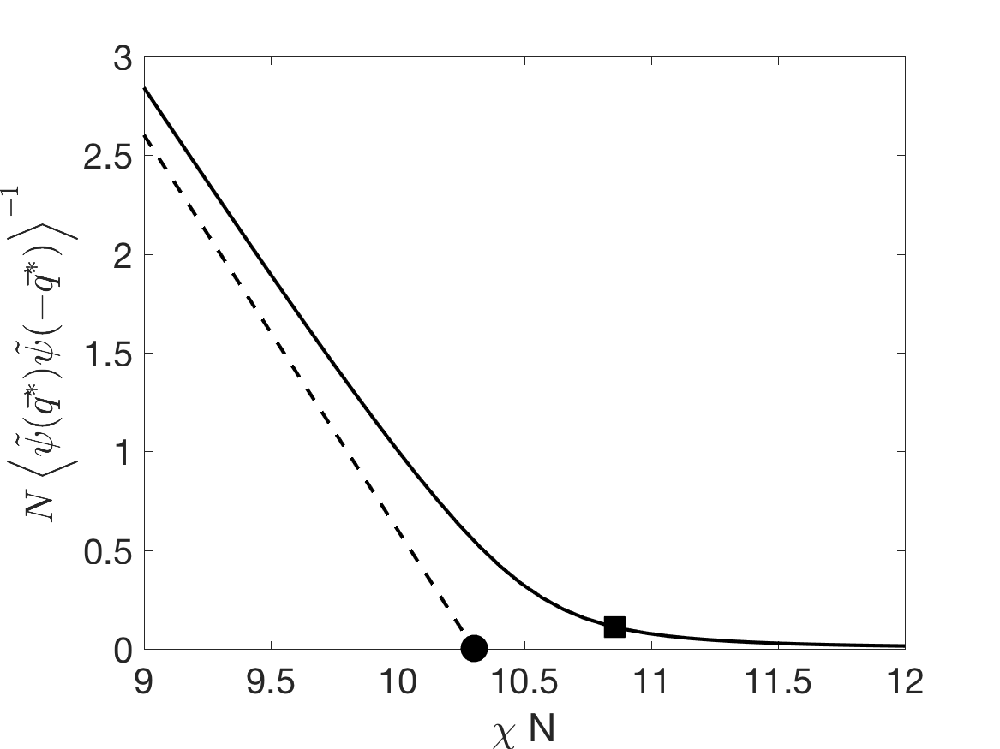
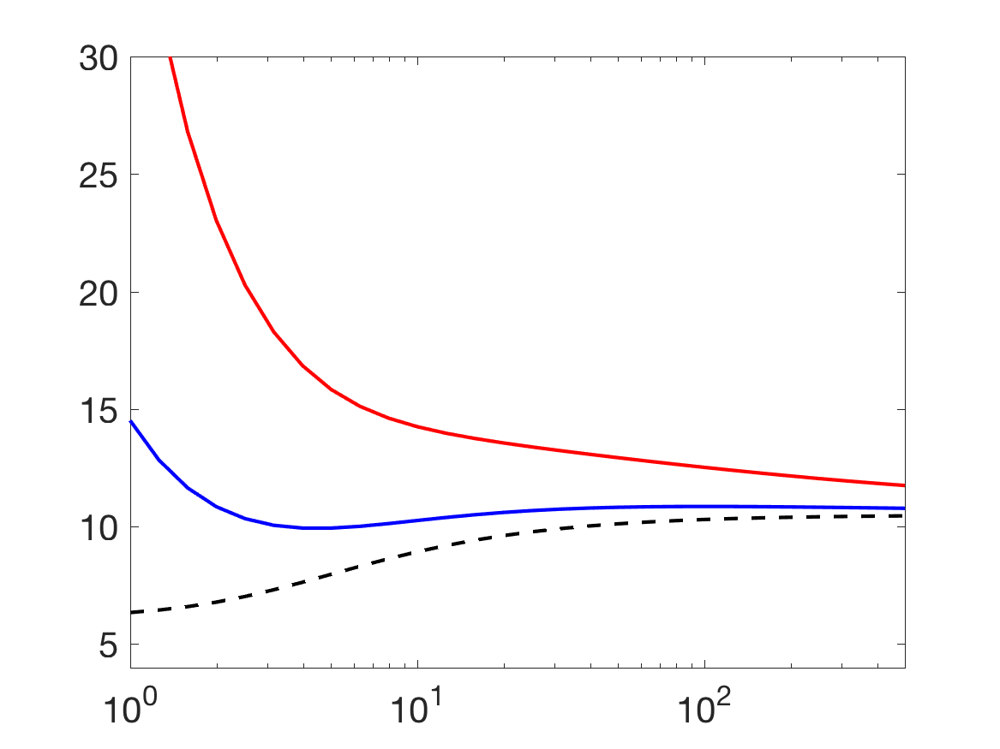
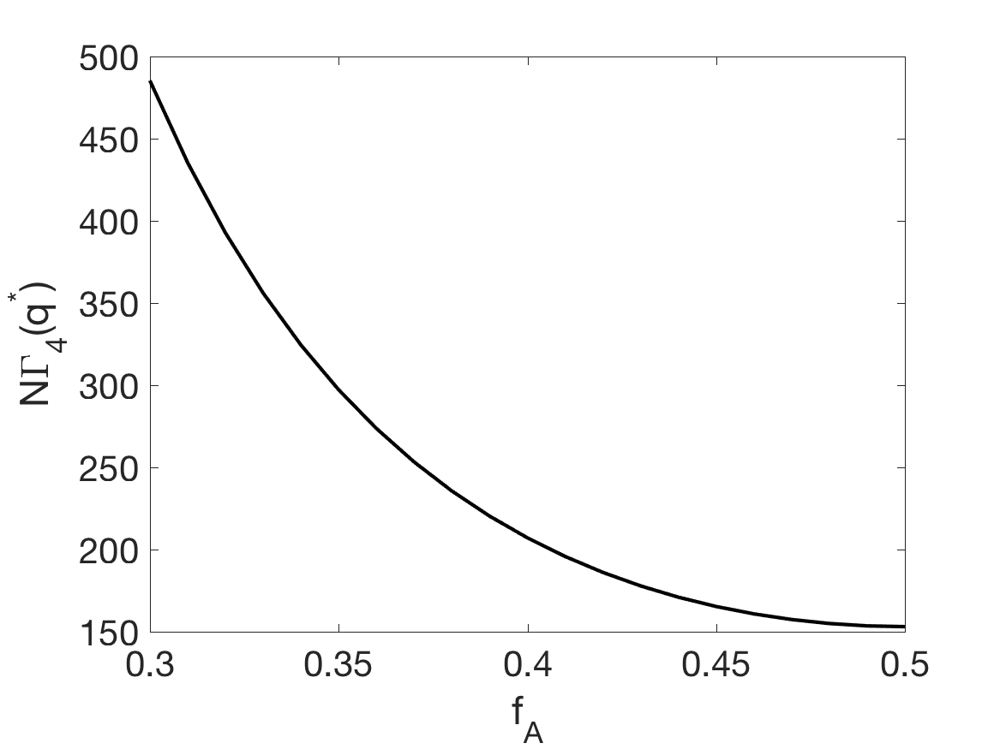

# diblockcopoly
=======================================

This is a function that uses polymer field theory to find phase behavior of diblock copolymers.

The polymers are modeled as wormlike chains, Gaussian chains, and perfectly rigid rods.
Phase transition spinodal and critical wavemode of phase segregation can be found at different
chemical correlation and monomer rigidities.

Renormalized phase diagrams are found by F-H/Brazovskii theory of free energy expansion
up to quartic-order density fluctuations.

# Table of Contents
1. [Installation] (README.md#installation)
2. [Example 1: Phase Diagrams and Scattering Functions] (README.m#example-1)
3. [Example 2: Molecular Weight Dependence] (README.md#example-2)
4. [Input specifications] (README.md#input-specifications)

##Installation
Open Matlab and change directory to `diblockcopoly`. Then add the following folders to path with
```
addpath('functions')
addpath('chainstats')
addpath('misc')
addpath('chainstats/eigcalc')
addpath('chainstats/integrals')
```

##Example 1
Example 1: Phase Diagrams and Scattering Functions
First focus on diblock copolymers with some molecular weight. For example:
```
N=100;  % number of statistical steps of total chain
FAV=linspace(0.1,0.5,41);  % range of A monomer chemical composition
alpha=4;  % chain aspect ratio
```
With these variables, one can plot a MF diblock copolymer phase diagram using function `plotphase` with
```
plotphase(N,FAV);
```


If fluctuation effects needs to be considered, one can make a phase diagram with presence of density fluctuations with `plotphaseRG`.
```
plotphaseRG(N,alpha,FAV);
```


Density-density correlations (structure factors) can be plotted using `densityRG`, along with inverse of peak intensity.
```
densityRG(N,alpha,0.5);
```



##Example 2
Example 2: Molecular Weight Dependence
Here are some examples of molecular weight effects on phase transition, etc.
The MF phase transition spinodal of diblock copolymer, and MF domain size `1/q^*` at different chain rigidities can be found with function `spinodal`.
```
NV=logspace(-1,4,21)';  % number of statistical steps of total chain
chis=zeros(length(NV),1);
ks=zeros(length(NV),1);
for ii = 1:length(NV)
    [chis(ii),ks(ii),d2gam2]=spinodal(NV(ii),0.5);
end
figure;semilogx(NV,chis.*NV);xlabel('N');ylabel('\chiN')
figure;loglog(NV,1./ks);xlabel('N');ylabel('1/q^*')
```


The effect of density fluctuations of the above spinodal can be found with function `spinodalRG`.
```
chit=zeros(length(NV),1);
for ii = 1:length(NV)
    [chit(ii),phase]=spinodalRG(NV(ii),alpha,0.5);
end
```
For comparison, renormalized spinodals can be plotted against MF and empirical solutions
```
figure;hold;set(gca,'fontsize',20)
plot(NV,chis.*NV,'k--','linewidth',2)
plot(NV,chit.*NV,'k-','MarkerSize',8)
```


Finally, vertex functions of free energy expansion at different chemical compositions can be found using functions `calcgamma`.
```
NQ=1;  % number of wavevector sets in calculating GAM4
[gam3,gam4]=calcgamma(N,FAV,NQ);
figure;plot(FAV,-gam3*N,'k-','linewidth',2);xlim([0.2,0.5]);
xlabel('f_A');ylabel('-N\Gamma_3(q^*)')
figure;plot(FAV,gam4*N,'k-','linewidth',2);xlim([0.3,0.5]);
xlabel('f_A');ylabel('N\Gamma_4(q^*)')
```



##Input specifications
N, number of Kuhn steps of total chain. In general chains are modeled as worm-like chains. In the limit N>1e4, Gaussian chain statistics are used; in the other limit N<1e-4, perfectly rigid rod statistics are used
FA, chemical composition of A type monomers