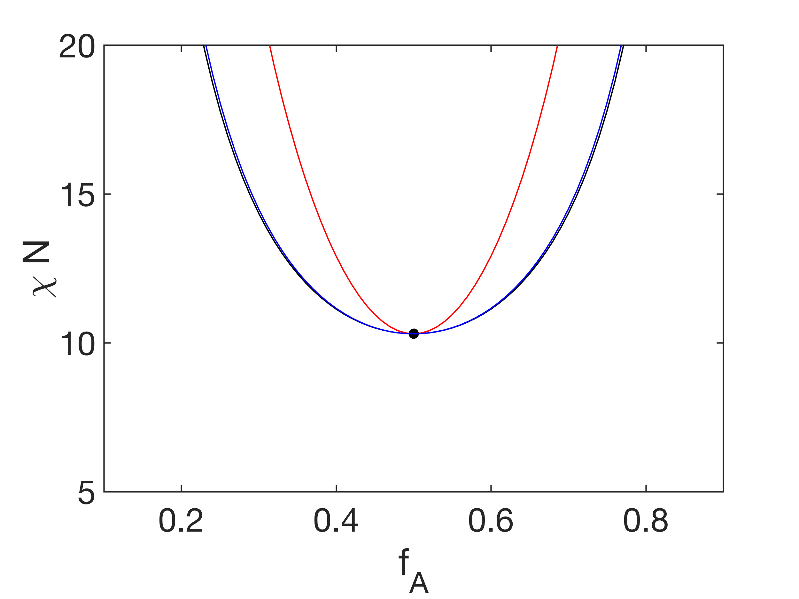
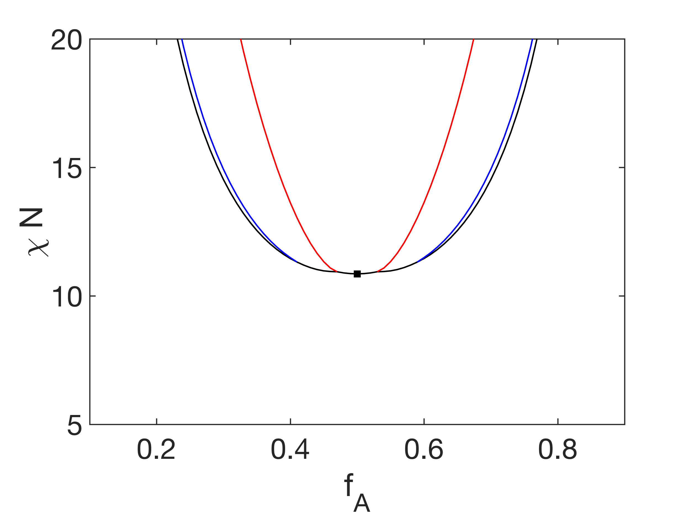
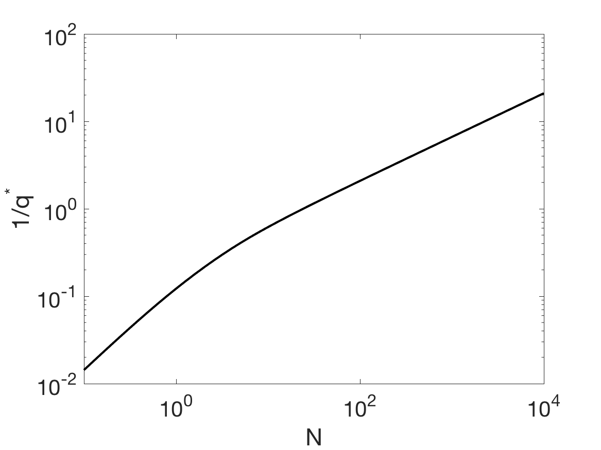
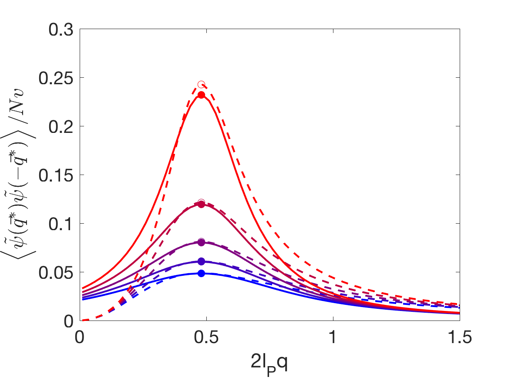
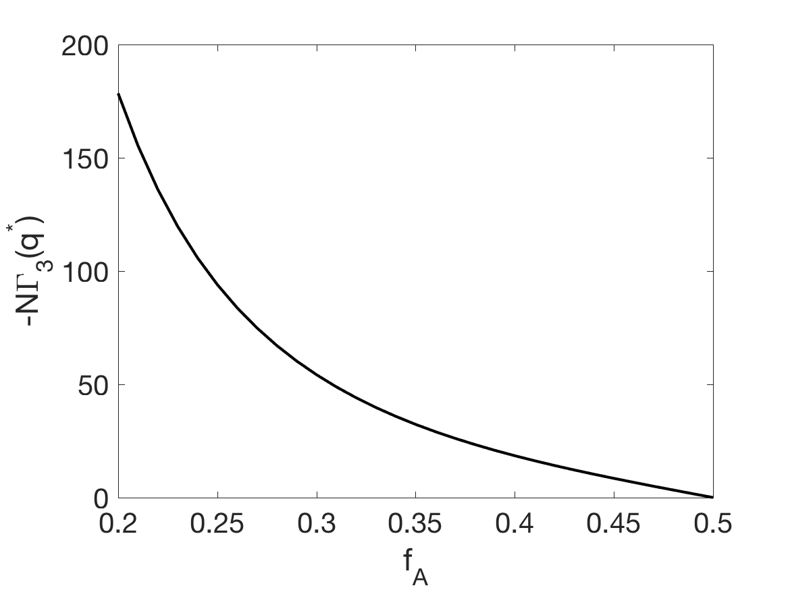

# diblockcopoly
=======================================

This is a function that uses polymer field theory to find phase behavior of diblock copolymers

The polymers are modeled as wormlike chains, Gaussian chains, and perfectly rigid rods.
Phase transition spinodal and critical wavemode of phase segregation can be found at different
chemical correlation and monomer rigidities.

Renormalized phase diagrams are found by F-H/Brazovskii theory of free energy expansion
up to quartic-order density fluctuations.

## Run example
Here is a walkthrough of example.m

Open Matlab and change directory to `diblockcopoly`. Then add the following folders to path with
```
addpath('functions')
addpath('chainstats')
addpath('misc')
addpath('chainstats/eigcalc')
addpath('chainstats/integrals')
```

Next define the variables of interests. For example:
```
N=1e4;  % number of statistical steps of total chain
FAV=linspace(0.1,0.5,41);  % range of A monomer chemical composition
C=1e3;  % dimensionless excluded volume parameter in the Gaussian limit
        % In the Gaussian chain limit, Nbar = C^2
```
With these variables, one can plot a MF diblock copolymer phase diagram using function `plotphase` with
```
plotphase(N,FAV);
```


If fluctuation effects needs to be considered, one can make a phase diagram with presence of density fluctuations with
```
plotphaseRG(N,C,FAV);
```


The MF phase transition spinodal of diblock copolymer, and MF domain size `1/q^*` at different chain rigidities can be found with
```
NV=logspace(-1,3,20);  % number of statistical steps of total chain
[chis,ks,d2gam2]=spinodal(NV,0.5);
figure;semilogx(NV,chis.*NV);xlabel('N');ylabel('\chiN')
figure;loglog(NV,1./ks);xlabel('N');ylabel('1/q^*')
```



The effect of density fluctuations of the above spinodal can be found with
```
CV=logspace(1,4,21);
[chit,phase]=spinodalRG(N,CV,0.5);
chit=reshape(chit,length(CV),1);
```

For comparison, renormalized spinodals can be plotted against MF and empirical solutions
```
col='b';
plot(CV.^2,ones(length(CV),1)*spinodal(N,0.5)*N,'--','linewidth',2,'color',col)
plot(CV.^2,chit*N,'s','MarkerSize',8,'MarkerFaceColor',col,'MarkerEdgeColor',col);

% %Empirical solutions
plot(CV.^2,ones(length(CV),1)*10.495,'--','linewidth',2,'color','k')
set(gca,'xscale','log');box on
xlabel('C^2');ylabel('\chiN');title(['N=',num2str(N)])
legend('MF theory','Renormalized ODT','Fit')
```


Density-density correlations (structure factors) can be plotted using
```
densityRG(N,C,0.5);
```


Finally, vertex functions of free energy expansion
```
NQ=1;  % number of wavevector sets in calculating GAM4
[gam3,gam4]=calcgamma(N,FAV,NQ);
figure;plot(FAV,-gam3*N,'k-','linewidth',2);xlim([0.2,0.5]);
xlabel('f_A');ylabel('-N\Gamma_3(q^*)')
figure;plot(FAV,gam4*N,'k-','linewidth',2);xlim([0.3,0.5]);
xlabel('f_A');ylabel('N\Gamma_4(q^*)')
```



## Input specifications
N, number of Kuhn steps of total chain. In general chains are modeled as worm-like chains. In the limit N>1e4, Gaussian chain statistics are used; in the other limit N<1e-4, perfectly rigid rod statistics are used
FA, chemical composition of A type monomers